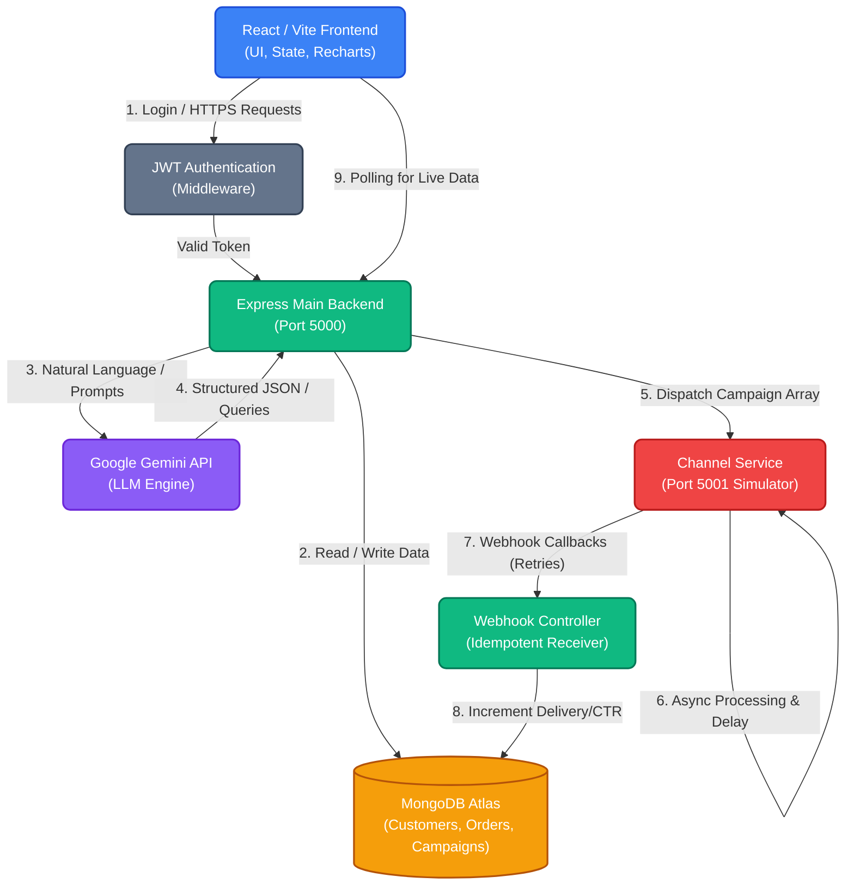

# PulseCRM AI: Complete Architecture & Database Design

This document serves as the master blueprint for PulseCRM AI. It explains the "Why" behind the product philosophy, the existing software architecture, an in-depth design of the MongoDB database, and the roadmap for upcoming features.

---

## 1. Product Philosophy & Overview (The "Why")

**PulseCRM AI is not just a CRM with AI bolted on; it is an AI-first Marketing Copilot.** 
Traditional CRMs require complex, specialized knowledge to build queries (e.g., "SQL-like" segment builders) and copywriters to generate messaging. PulseCRM AI abstracts this complexity by making natural language the primary interface. 

**Core Principles:**
- **Zero Learning Curve:** Marketers state what they want (e.g., "Find customers who spent > $500 but are at risk of churning"), and the AI translates it into database queries.
- **Automated Intelligence:** The system proactively suggests campaigns based on order velocity and customer behavior.
- **SaaS-Grade Aesthetics:** Designed to feel like Linear or Stripe—minimalist, dense, high-contrast, and blisteringly fast.

---

## 2. System Architecture (The "How")

To balance high development velocity with production-grade separation of concerns, the system uses a **Monolith + Worker** pattern.



### Frontend (React + Vite + Tailwind + shadcn)
- **Why Vite/React?** Blazing fast local development and a massive ecosystem.
- **Why shadcn & Tailwind?** Allows us to build a fully custom, premium UI system without the bloat of generic component libraries like Bootstrap or Material UI.
- **State Management:** `TanStack React Query` handles server state, caching, and background polling (essential for real-time analytics).

### CRM Backend (Node.js + Express + TypeScript)
- **Why Node/Express?** Standard, reliable, and perfectly suited for heavy I/O operations (like fetching customers and pushing to external services).
- **AI Integration:** Google Gemini acts as the translation layer between the user's natural language and structured Mongoose JSON queries.

### Channel Service (The Simulated Worker)
- **Why separate it?** In a real startup, dispatching 100,000 SMS messages synchronously in the main CRM thread would crash the app. The separate Node.js service simulates a distributed worker queue (like Kafka or RabbitMQ) by accepting batches, processing them with artificial latency/failure rates, and firing asynchronous Webhooks back to the CRM.

---

## 3. MongoDB Database Design

Below is the definitive schema design for PulseCRM AI. MongoDB was chosen for its schema flexibility (crucial for storing complex AI segment queries) and rapid iteration capabilities.

### 1. `Users` Collection
**Purpose:** Stores the authentication and identity data of the CRM marketers (the employees using the SaaS).

- **Fields:**
  - `_id`: ObjectId
  - `name` (String, Required): Display name for the dashboard UI.
  - `email` (String, Required, Unique): Used for login credentials.
  - `passwordHash` (String, Required): Bcrypt hashed password for security.
  - `createdAt` (Date): Audit trail for account creation.
- **Validation:** Mongoose handles unique constraint on `email`.
- **Indexes:** `{ email: 1 }` (Unique) for lightning-fast login lookups.
- **Relationships:** Referenced by `ActivityLog.userId`.

### 2. `Customers` Collection
**Purpose:** The core audience table representing the end-users who buy from the brand.

- **Fields:**
  - `firstName`, `lastName` (String, Required): Personalization for campaigns.
  - `email` (String, Required, Unique): Primary contact method.
  - `phone` (String, Optional): Secondary contact method.
  - `totalSpent` (Number, Default: 0): Denormalized from Orders. *Why?* Aggregating orders on the fly for thousands of customers is slow. Denormalizing allows instant querying.
  - `lastOrderDate` (Date): Enables "Win-back" query logic (e.g., last order > 30 days).
  - `aiTags` ([String]): Tags generated by AI (e.g., "Whale", "Churn-Risk") used for instant frontend badging.
- **Validation:** Standard string checks; `totalSpent` must be >= 0.
- **Indexes:** 
  - `{ email: 1 }` (Unique)
  - `{ totalSpent: -1 }` (Speeds up High-Value segment queries)
  - `{ lastOrderDate: -1 }` (Speeds up Churn segment queries)

### 3. `Orders` Collection
**Purpose:** Represents a single purchase made by a Customer.

- **Fields:**
  - `customerId` (ObjectId, Required, Ref: 'Customer'): Links back to the buyer.
  - `amount` (Number, Required): The transaction value.
  - `status` (String, Enum: ['Completed', 'Pending', 'Cancelled']): Order state.
  - `orderDate` (Date): When the purchase occurred.
- **Validation:** `amount` must be > 0.
- **Indexes:** `{ customerId: 1, orderDate: -1 }` (Compound index to quickly find a customer's recent orders).

### 4. `Segments` Collection
**Purpose:** Stores the AI-generated audience filters so they can be reused for future campaigns.

- **Fields:**
  - `name` (String, Required): Human-readable identifier (e.g., "VIP Summer Shoppers").
  - `description` (String): The original natural language prompt used to generate this segment.
  - `rules` (Array): The structured business rules (e.g., `[{ field: "totalSpent", operator: "gt", value: 5000 }]`) used to build the query.
  - `aiInterpretation` (String): The plain-English translation of the rules provided by Gemini.
  - `recommendations` (Mixed): Proactive AI strategy (campaign type, channel, discount, confidence score).
  - `createdAt` (Date): Audit trail.
- **Indexes:** `{ name: 1 }` for alphabetical sorting in dropdowns.

### 5. `Campaigns` Collection
**Purpose:** Represents an overarching marketing blast sent to a specific Segment.

- **Fields:**
  - `name` (String, Required): Internal campaign name.
  - `segmentId` (ObjectId, Required, Ref: 'Segment'): The audience being targeted.
  - `messageTemplate` (String, Required): The AI-generated copy (e.g., "Hey {firstName}, get 20% off!").
  - `status` (String, Enum: ['Draft', 'Running', 'Completed']): Tracks the lifecycle of the blast.
  - `createdAt` (Date): Audit trail.
- **Indexes:** `{ status: 1, createdAt: -1 }` (To quickly fetch "Active" campaigns for the dashboard).

### 6. `Communications` Collection
**Purpose:** Represents a single, individual message sent to a specific customer as part of a campaign. 

- **Fields:**
  - `campaignId` (ObjectId, Required, Ref: 'Campaign'): Parent campaign.
  - `customerId` (ObjectId, Required, Ref: 'Customer'): Recipient.
  - `status` (String, Enum: ['Pending', 'Sent', 'Failed']): Delivery state.
  - `dispatchedAt` (Date): When the CRM sent it to the Channel Service.
  - `resolvedAt` (Date): When the Webhook callback confirmed success/failure.
- **Validation:** Cannot exist without both a Campaign and a Customer.
- **Indexes:** 
  - `{ campaignId: 1, status: 1 }` (Crucial for determining when a campaign is fully 'Completed').
  - `{ customerId: 1 }` (To show a customer's message history in their detail drawer).

### 7. `Analytics` Collection
**Purpose:** Stores aggregated delivery metrics and AI narratives for a campaign.

- **Fields:**
  - `campaignId` (ObjectId, Required, Ref: 'Campaign', Unique): 1-to-1 relationship with a Campaign.
  - `totalSent` (Number): Total communications generated.
  - `successfulDeliveries` (Number): Count of 'Sent' webhooks.
  - `failedDeliveries` (Number): Count of 'Failed' webhooks.
  - `aiInsights` (String): An AI-generated paragraph explaining the performance anomalies (e.g., "High bounce rate due to outdated emails").
- **Why a separate collection?** Storing this directly on the `Campaign` document would cause heavy write-locking issues during massive webhook floods. Isolating it allows high-frequency `$inc` updates without locking the core Campaign data.
- **Indexes:** `{ campaignId: 1 }` (Unique).

### 8. `ActivityLogs` Collection
**Purpose:** A generic audit trail for security and enterprise compliance.

- **Fields:**
  - `userId` (ObjectId, Required, Ref: 'User'): Who performed the action.
  - `action` (String, Required): e.g., "Launched Campaign", "Created Segment".
  - `resourceType` (String, Required): e.g., "Campaign", "Customer".
  - `resourceId` (ObjectId, Optional): ID of the affected resource.
  - `timestamp` (Date, Indexed): When it happened.
- **Indexes:** `{ timestamp: -1 }` (For rendering chronological activity feeds).

---

## 4. Upcoming Features & Evolution (Next Steps)

While the current architecture solves the immediate need, a true hyper-growth SaaS will encounter scale issues. Here is how PulseCRM AI will evolve:

1. **Message Queue Integration (Kafka/RabbitMQ):**
   - *Current:* Node.js memory loop pushing HTTP arrays.
   - *Upcoming:* When scaling to 1M+ customers, we will drop message payloads into an AWS SQS or Kafka topic to ensure zero data loss during network partitions.
2. **ClickHouse for Analytics:**
   - *Current:* MongoDB `$inc` operators.
   - *Upcoming:* Moving delivery events (Opens, Clicks, Bounces) to a columnar database like ClickHouse to allow real-time, multi-dimensional OLAP slicing.
3. **Multi-Tenancy & SSO:**
   - *Upcoming:* Modifying every collection to include a `tenantId` field to support B2B SaaS architecture, alongside SAML/SSO integration for enterprise onboarding.
4. **Vector Database (pgvector/Pinecone):**
   - *Upcoming:* Instead of relying solely on structured JSON queries, we will embed customer profiles as vectors to allow semantic similarity searches (e.g., "Find customers *similar to* Alice").

---

## 5. REST API Documentation

The following details the RESTful contract between the React Frontend, the CRM Node.js Backend, and the simulated Channel Service. All CRM Backend endpoints (except Auth and Webhooks) require a JWT Bearer token.

### 1. Authentication APIs
**POST /api/auth/register**
- **Purpose:** Register a new marketer account.
- **Request Body:** `{ "name": "John", "email": "john@example.com", "password": "securepass" }`
- **Response:** `{ "_id": "...", "name": "John", "email": "john@example.com", "token": "jwt_token..." }`
- **Status Codes:** `201 Created` (Success), `400 Bad Request` (User exists or missing fields).

**POST /api/auth/login**
- **Purpose:** Authenticate an existing user and return a JWT.
- **Request Body:** `{ "email": "john@example.com", "password": "securepass" }`
- **Response:** `{ "_id": "...", "name": "John", "email": "john@example.com", "token": "jwt_token..." }`
- **Status Codes:** `200 OK` (Success), `401 Unauthorized` (Invalid credentials).

### 2. Customer APIs
**GET /api/customers**
- **Purpose:** Fetch the global directory of customers for the Data Table.
- **Request Body:** `None`
- **Response:** `[ { "_id": "...", "firstName": "Alice", "lastName": "Smith", "totalSpent": 1200, "aiTags": ["High-Value"] } ]`
- **Status Codes:** `200 OK`

**POST /api/customers**
- **Purpose:** Create a new customer manually.
- **Request Body:** `{ "firstName": "Alice", "lastName": "Smith", "email": "alice@ex.com" }`
- **Response:** `{ "_id": "...", "firstName": "Alice", ... }`
- **Status Codes:** `201 Created`, `400 Bad Request`.

### 3. Order APIs
**GET /api/orders**
- **Purpose:** Fetch recent orders across the platform.
- **Request Body:** `None`
- **Response:** `[ { "_id": "...", "customerId": { ... }, "amount": 150, "status": "Completed" } ]`
- **Status Codes:** `200 OK`

**POST /api/orders**
- **Purpose:** Ingest a new order (often called by an external storefront like Shopify). Automatically triggers business logic to update the associated customer's `totalSpent` and `lastOrderDate`.
- **Request Body:** `{ "customerId": "...", "amount": 250 }`
- **Response:** `{ "_id": "...", "amount": 250, "status": "Completed" }`
- **Status Codes:** `201 Created`

### 4. Segment & AI APIs
**POST /api/segments/preview** (The Core AI Endpoint)
- **Purpose:** Uses Google Gemini to translate a natural language prompt into structured JSON UI rules. The backend translates these rules into a valid Mongoose query object, executing it against the DB to return a sample of matching users, insights, and campaign recommendations.
- **Request Body:** `{ "prompt": "customers who spent more than 500 but haven't ordered recently" }` OR `{ "manualRules": [{...}] }`
- **Response:** `{ "customers": [{...}], "totalMatches": 45, "rules": [{...}], "aiInterpretation": "I found...", "recommendations": {...}, "insights": {...} }`
- **Status Codes:** `200 OK`, `500 Internal Server Error` (AI parsing failure).

**POST /api/segments**
- **Purpose:** Save an AI-generated segment permanently for future campaigns.
- **Request Body:** `{ "name": "VIP Churn Risks", "description": "...", "rules": [...] }`
- **Response:** `{ "_id": "...", "name": "VIP Churn Risks", "rules": [...] }`
- **Status Codes:** `201 Created`

**GET /api/segments**
- **Purpose:** Fetch all saved segments to populate the Campaign Builder dropdown.
- **Request Body:** `None`
- **Response:** `[ { "_id": "...", "name": "VIPs", "description": "spent > 500" } ]`
- **Status Codes:** `200 OK`

### 5. Campaign APIs
**POST /api/campaigns**
- **Purpose:** Takes a natural language prompt and a target `segmentId`. It hits Gemini to generate contextual marketing copy tailored to that segment, then creates a Campaign in `Draft` status.
- **Request Body:** `{ "name": "Summer Sale", "segmentId": "...", "prompt": "Write a 2-sentence urgent SMS." }`
- **Response:** `{ "_id": "...", "name": "Summer Sale", "messageTemplate": "Hey! 20% off ends tonight...", "status": "Draft" }`
- **Status Codes:** `201 Created`

**GET /api/campaigns**
- **Purpose:** Fetch all campaigns.
- **Request Body:** `None`
- **Response:** `[ { "_id": "...", "name": "Summer Sale", "status": "Running" } ]`
- **Status Codes:** `200 OK`

**POST /api/campaigns/:id/launch**
- **Purpose:** The dispatcher. Validates the draft, identifies all matching customers for the segment, generates `Pending` Communication records, updates Analytics, and fires the payload to the Channel Service.
- **Request Body:** `None`
- **Response:** `{ "message": "Campaign launched successfully", "count": 150 }`
- **Status Codes:** `200 OK`, `400 Bad Request` (Campaign is not in Draft state).

### 6. Channel APIs (External Worker Simulation - Port 5001)
**POST /dispatch**
- **Purpose:** Accepts batch communications from the CRM. It immediately acknowledges the request to avoid blocking the CRM, then asynchronously processes the queue (simulating network latency and 90% delivery success rates).
- **Request Body:** `{ "campaignId": "...", "communications": [ { "_id": "...", "customerId": "...", "message": "..." } ] }`
- **Response:** `{ "status": "accepted", "count": 150 }`
- **Status Codes:** `202 Accepted`

### 7. Receipt (Webhook) APIs
**POST /api/webhooks/delivery**
- **Purpose:** Secure callback endpoint for the Channel Service to report delivery outcomes. Implements idempotency (ignores already processed messages) and atomically increments the Campaign's overarching Analytics metrics.
- **Request Body:** `{ "communicationId": "...", "campaignId": "...", "status": "Sent", "timestamp": "2023-10-01T12:00:00Z" }`
- **Response:** `{ "message": "Webhook processed successfully" }`
- **Status Codes:** `200 OK`

### 8. Analytics APIs
**GET /api/analytics/:campaignId**
- **Purpose:** Fetch real-time delivery telemetry and AI-generated performance insights for a specific campaign. The React frontend polls this endpoint every 5 seconds while a campaign is running.
- **Request Body:** `None`
- **Response:** `{ "campaignId": "...", "totalSent": 150, "successfulDeliveries": 145, "failedDeliveries": 5, "aiInsights": "Strong performance driven by urgency..." }`
- **Status Codes:** `200 OK`, `404 Not Found`

---

## 6. Scalable Frontend Folder Structure (React + Vite + TypeScript)

To ensure the frontend remains maintainable, predictable, and interview-ready as it scales, we follow a strict separation of concerns within the `frontend/src` directory. This structure is heavily inspired by production SaaS standards (e.g., Bulletproof React).

```text
src/
├── assets/         
├── components/     
│   ├── ui/         
│   └── shared/     
├── context/        
├── hooks/          
├── layouts/        
├── pages/          
├── services/       
├── types/          
└── utils/          
```

### Responsibility Breakdown

#### 1. `assets/`
- **Purpose:** Houses static files that are imported into components, such as SVGs, images, fonts, and the global `index.css` file.
- **Rule:** Do not store dynamic data or JSON mocks here.

#### 2. `components/`
- **Purpose:** Reusable, stateless UI building blocks. It is strictly divided into two subdirectories:
  - `ui/`: Generic, "dumb" primitives (e.g., `Button.tsx`, `Card.tsx`, `Input.tsx`). We use **shadcn/ui** to automatically generate these into this folder. They should have no business logic.
  - `shared/`: Domain-specific components used across multiple pages (e.g., `CustomerAvatar.tsx`, `CampaignStatusBadge.tsx`).

#### 3. `context/`
- **Purpose:** Global state management using React Context API.
- **Rule:** Only use for truly global state that changes infrequently, such as `AuthContext` (managing the JWT token and user session) or `ThemeContext` (Dark/Light mode). Dynamic server state is handled by TanStack Query, not Context.

#### 4. `hooks/`
- **Purpose:** Custom React hooks that encapsulate reusable component logic or DOM side-effects.
- **Examples:** `useDebounce` (for search inputs), `useMediaQuery` (for responsive UI adjustments), or `useAuth` (to easily access the AuthContext).

#### 5. `layouts/`
- **Purpose:** Page wrappers that govern the overarching structural UI (headers, sidebars, footers).
- **Examples:** `MainLayout.tsx` (contains the sidebar and top navigation for authenticated users) and `AuthLayout.tsx` (a minimalist wrapper for the login/register screens).

#### 6. `pages/`
- **Purpose:** Route-level, stateful components. These correspond directly to URLs in `react-router-dom`.
- **Rule:** Pages should orchestrate data fetching and layout, but delegate heavy UI rendering to child components. (e.g., `Dashboard.tsx`, `Customers.tsx`).

#### 7. `services/`
- **Purpose:** The communication layer with the outside world.
- **Examples:** `api.ts` (the Axios instance with interceptors) and `aiService.ts` (for dedicated third-party API logic). Keeping API calls here instead of inside components makes mocking and testing infinitely easier.

#### 8. `types/`
- **Purpose:** Global TypeScript interfaces and type definitions representing our domain models.
- **Examples:** `customer.types.ts` (`export interface ICustomer {...}`). This ensures strict type safety across network requests and component props without circular dependencies.

#### 9. `utils/`
- **Purpose:** Pure, stateless JavaScript functions and helper methods.
- **Examples:** `formatCurrency.ts` (converting numbers to $ strings), `dateUtils.ts`, and `cn()` (the utility used to merge Tailwind CSS classes dynamically).

---

## 7. Scalable Backend Folder Structure (Express + TypeScript)

To ensure the backend API remains resilient and decoupled, we strictly adhere to **Clean Architecture** principles. The `backend/src` directory is divided into distinct layers, ensuring that HTTP logic never bleeds into business logic or database queries.

```text
backend/src/
├── config/         
├── controllers/    
├── jobs/           
├── middleware/     
├── models/         
├── routes/         
├── services/       
├── utils/          
└── validators/     
```

### Responsibility Breakdown

#### 1. `config/`
- **Purpose:** Centralized configuration management.
- **Responsibility:** Handles environment variable parsing and initializes connections to infrastructure like MongoDB (`db.ts`), Redis, or external SDKs. It ensures the app crashes early on boot if critical `.env` variables are missing.

#### 2. `routes/` (The Routing Layer)
- **Purpose:** URL definition mapping.
- **Responsibility:** Strictly defines HTTP verbs (GET, POST) and endpoints. It strings together middleware, validators, and finally delegates to the appropriate controller. No business logic belongs here.

#### 3. `middleware/` (The Interceptor Layer)
- **Purpose:** Reusable Express HTTP request interceptors.
- **Responsibility:** Handles cross-cutting concerns before a request reaches the controller. Examples include JWT authentication (`authMiddleware.ts`), global error catching, rate limiting, and request logging.

#### 4. `validators/` (The Sanitization Layer)
- **Purpose:** Request payload validation.
- **Responsibility:** Uses libraries like `Zod` or `Joi` to verify that incoming HTTP request bodies exactly match expected schemas. If a payload is malformed, it throws a `400 Bad Request` before the controller even executes, preventing database pollution.

#### 5. `controllers/` (The Presentation Layer)
- **Purpose:** Translating HTTP into Business Logic.
- **Responsibility:** The controller's *only* job is to extract data from `req.body` or `req.params`, pass it to a Service function, and format the resulting data into an HTTP response (e.g., `res.status(200).json(...)`). It must not contain raw Mongoose queries.

#### 6. `services/` (The Business Logic Layer)
- **Purpose:** The core intelligence of the CRM.
- **Responsibility:** Where the actual work happens. Services encapsulate complex domain logic (e.g., `aiService.ts` talking to Gemini, or `campaignService.ts` generating pending communications). By decoupling this from controllers, we can execute the exact same business logic from an HTTP request *or* a background cron job.

#### 7. `models/` (The Data Access Layer)
- **Purpose:** Database interaction and strict typing.
- **Responsibility:** Defines Mongoose schemas, indexes, virtuals, and TypeScript interfaces representing the MongoDB collections. 

#### 8. `jobs/` (The Background Worker Layer)
- **Purpose:** Asynchronous, heavy background processing.
- **Responsibility:** Houses CRON jobs or worker queue processors (e.g., a job that wakes up every hour to aggregate Analytics, or the dispatcher that flushes Pending communications to the Channel Service). Keeps heavy operations out of the synchronous HTTP request-response cycle.

#### 9. `utils/`
- **Purpose:** Generic, domain-agnostic helper functions.
- **Responsibility:** Functions that can be copy-pasted into any node project. Examples: Password hashing wrappers (`cryptoUtils.ts`), date manipulation, or custom logger wrappers.

---

## 8. JWT Authentication Strategy

Security and Identity are critical for a production CRM. The system employs stateless **JSON Web Tokens (JWT)** for authentication, avoiding the overhead of sticky sessions or Redis session stores.

Here is a step-by-step breakdown of how Authentication is built across the stack:

### 1. MongoDB User Model & Password Hashing
- **File:** `backend/src/models/User.ts`
- **Implementation:** When a user registers, we do not store plaintext passwords. The `authController.ts` uses `bcryptjs` to generate a 10-round salt and hashes the password before saving it to MongoDB.
- **Security Practice:** Bcrypt includes the salt inside the hash itself, inherently defending against Rainbow Table attacks.

### 2. The Signup & Login Flow
- **Files:** `backend/src/controllers/authController.ts`
- **Implementation:** 
  - On **Signup**, the system validates inputs and checks if the email is already registered. If not, it creates the user, generates a JWT using `jsonwebtoken.sign()`, and returns it alongside the user profile.
  - On **Login**, the system queries MongoDB for the email, uses `bcrypt.compare()` to verify the provided password against the hash, and returns a fresh JWT.
- **Security Practice:** JWTs are signed using a server-side `JWT_SECRET` injected via environment variables.

### 3. JWT Access Token Generation
- **Implementation:** The JWT encodes the MongoDB `_id` of the user in its payload. It is configured to expire in 30 days (`expiresIn: '30d'`). This ensures that even if a token is intercepted, its lifetime is restricted.

### 4. Backend Middleware Protection (Protected Routes)
- **File:** `backend/src/middleware/auth.ts`
- **Implementation:** We built a custom Express middleware called `protect`. 
  - It intercepts incoming HTTP requests to protected routes (like `/api/campaigns`).
  - It expects an `Authorization: Bearer <token>` header.
  - It uses `jwt.verify()` to decode the token. If valid, it attaches the `userId` to the `req` object (`req.user = { id: decoded.id }`) and calls `next()`. If invalid or missing, it rejects the request with a `401 Unauthorized`.

### 5. Frontend State & Interceptors
- **Files:** `frontend/src/context/AuthContext.tsx` & `frontend/src/services/api.ts`
- **Implementation:** Upon a successful backend response, the React frontend stores the JWT in `localStorage` and hydrates the global `AuthContext`. 
- **Axios Interceptor:** In `api.ts`, an Axios interceptor automatically intercepts *every* outgoing request and attaches the `Bearer <token>` to the `Authorization` header, completely abstracting auth logic away from individual components.

### 6. Frontend Protected Routes
- **File:** `frontend/src/components/ProtectedRoute.tsx`
- **Implementation:** A React Router wrapper component that acts as a UI guard. If an unauthenticated user tries to access `/` or `/campaigns`, it intercepts the render and automatically redirects them to `/login`, guaranteeing a seamless and secure UX.

---

## 9. Interview Preparation: Architecture Talking Points

**1. How is the AI Segment Builder implemented securely?**
*Answer:* By enforcing an architectural boundary. Gemini is instructed to NEVER generate raw MongoDB queries. Instead, it generates a standardized JSON array of "Business Rules" (e.g., `Field: totalSpent, Operator: gt, Value: 500`). The Express backend parses this JSON and programmatically builds the Mongoose query using a dedicated translation utility. This completely prevents NoSQL injection and allows the React frontend to easily render the JSON into a visual "Manual Builder" for perfect two-way synchronization.

**2. Why did you build a Dual-Mode UX for Segments?**
*Answer:* To balance power and accessibility. The AI Builder is essentially a Copilot that removes the "blank canvas" problem by instantly translating natural language into rules. However, marketers often need to tweak specific numbers or add Edge cases. The Manual Builder acts as the fallback interface, ensuring the user is never blocked if the AI hallucinates or if the Gemini API goes down.

**3. What happens if the Gemini API fails during segment generation?**
*Answer:* The application degrades gracefully. A Toast notification alerts the user, and the UI automatically falls back strictly to the `Manual Builder` tab. The core CRUD functionality of the CRM remains completely intact, ensuring business continuity.
